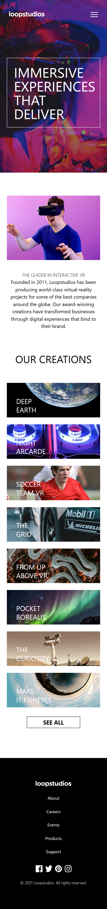

# Loopstudio Landing Page

This is a solution to the Loopstudio Landing Page challenge from Frontend Mentor.

## 📌 Overview

A fully responsive landing page built with HTML and Tailwind CSS. The project focuses on modern layout design, responsive structure, and clean UI implementation.

## 🚀 Features

- Fully responsive design (mobile, tablet, desktop)
- Modern landing page layout
- Smooth hover interactions
- Clean and semantic HTML structure
- Mobile-friendly navigation

## 🛠️ Built With

- HTML5
- Tailwind CSS
- Flexbox & CSS Grid

## 📷 Screenshots

### Desktop View

### Mobile View

## 🔗 Live Demo

[View Live Site](loopsided-landing-page.vercel.app)

## 📁 Repository

[GitHub Repo](https://github.com/MorakinyoErioluwa/loopsided-landing-page.git)

## 📌 Note

This project is part of my Frontend Mentor practice to improve my responsive design skills and layout building.